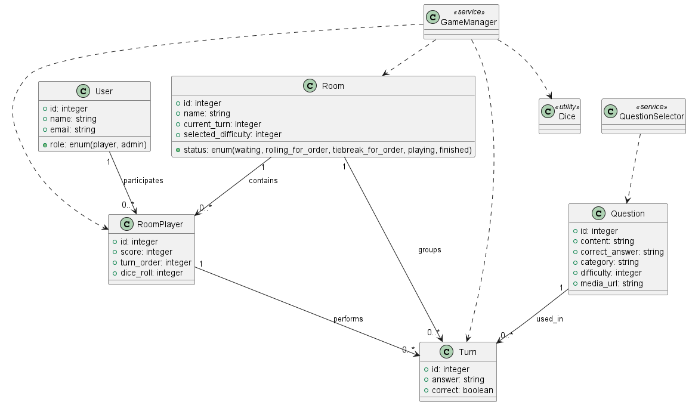

# QuizGame

**QuizGame** es juego tipo trivial multijugador desarrollado en **Ruby on Rails 8**, donde varios jugadores pueden unirse a una sala, responder preguntas por turnos y competir para ver quién obtiene la mejor puntuación.
(Es una mejora importante del CRUD de preguntas con ahorcado que tenia en nodeJS en el repo 'quiz' guiado por ChatGPT y desarrollado en un movil andorid usando una terminal Termux+proot-distro debian)

## Características planeadas

- Autenticación de usuarios con [Devise](https://github.com/heartcombo/devise)
- Sistema de salas: los jugadores podrán crear y unirse a salas activas
- Los jugadores se unen a una sala, tiran un dado para decidir el orden y luego responden preguntas por turnos.
- Juego por turnos sincronizado en tiempo real con [Action Cable](https://guides.rubyonrails.org/action_cable_overview.html)
- Sistema de preguntas categorizadas con niveles de dificultad
- Gestión de puntuaciones por jugador
- Interfaz sencilla y compatible con dispositivos móviles

## Estado del proyecto

En desarrollo inicial.

Hasta ahora se ha implementado:

- Estructura de modelos: `User`, `Room`, `RoomPlayer`, `Question`, `Turn`
- Autenticación con Devise
- Controlador y vistas básicas para gestión de salas
- Mostrar jugadores conectados en tiempo real (Hotwire/Turbo Streams.)
- Iniciar fase de tirada de dados para decidir el orden.  
- Animación al tirar el dado y lógica de desempate.  
- Cambio de estado de la sala (`waiting`, `rolling_for_order`, `tiebreak_for_order`, `playing`, `finished`).  
- Servicios (`DiceRollService`, `GameManager` en progreso). 

## Requisitos

- Ruby 3.2+ (usa [rvm](https://rvm.io/) o [rbenv](https://github.com/rbenv/rbenv) para gestionar versiones)
- PostgreSQL
- Node.js y Yarn (para assets JS)
- Redis

## Instalación y ejecución

- Servicio postgres y redis iniciados

(`service status postgres` y `redis-cli ping`)

```bash
bundle install
rails db:setup
rails server -b 0.0.0.0 -p 3000
```

Rails 8.0+

Optional:

Install cloudflared and add to hosts at config/enviroments/development.rb

`cloudflared tunnel --url http://localhost:3000`

or

`./start_dev.sh`

* Database creation

Create with user postgres!

* Database initialization

`rails db:setup`

* How to run the test suite

`rails test`

`bundle exec rubocop -a`

## Modelo de dominio

 Modelo de dominio detallado en [`docs/domain_model.puml`](docs/domain_model.puml).



## Pendientes / Próximos pasos / Roadmap
### Lógica del juego y turnos
 Integrar GameManager en controladores para delegar inicio de partida, turnos y desempates.

 Implementar next_turn! y sincronizarlo con las vistas (mostrar de quién es el turno actual).

 Añadir QuestionSelector para escoger preguntas por categoría y dificultad.

 Añadir lógica de respuesta y puntuación por turno.

### Persistencia y datos

 Añadir dificultad seleccionada a la Room.

 Validar integridad de RoomPlayer (uno por usuario por sala).

### Administración de preguntas
 Añadir role a User (enum role: { player: 0, admin: 1 }).

 Crear Admin::QuestionsController con CRUD.

 Permitir a admins subir preguntas con contenido multimedia (imagen/audio/vídeo).

 Mejorar modelo Question para soportar campo media_url.

### Tiempo real y comunicación
 Añadir broadcast para cambios de estado de la sala (cuando se inicia la partida, etc.).

(Ej. Turbo Streams en Rails 8. Considerar socket.io y ActionCable puro)

### Tests y calidad
 Escribir tests unitarios para GameManager, DiceRollService, QuestionSelector.

 Añadir tests de controladores para join, roll_dice, etc.

 Revisar linter y corregir errores (los que aparecían en GitHub Actions).

## 🤝 Contribuir
¡Toda sugerencia o PR es bienvenida!

© 2025 Joselon
